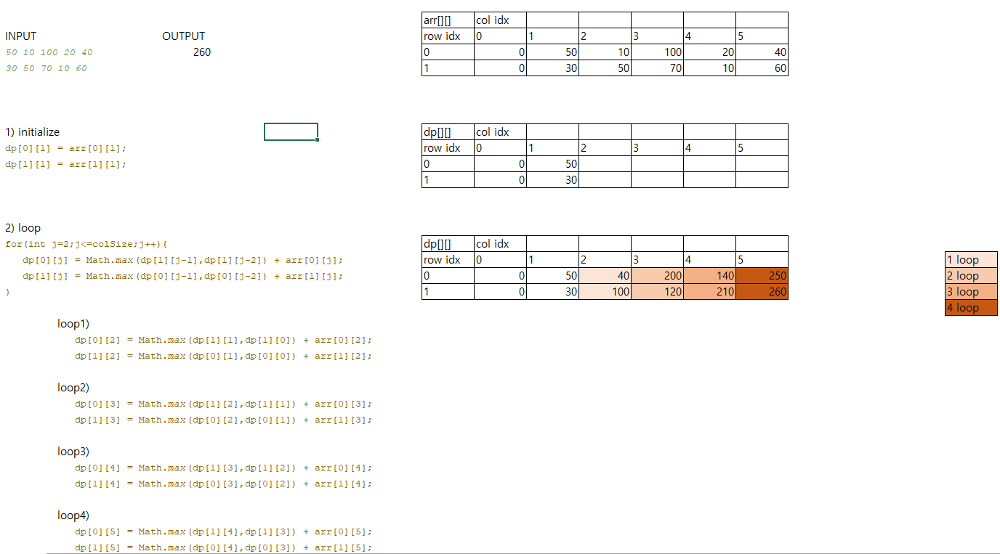

# 9465 스티커
  https://www.acmicpc.net/problem/9465
  
  **- 예제입력**
  
      2
      
      5
      
      50 10 100 20 40
      
      30 50 70 10 60
      
      7
  
      10 30 10 50 100 20 40
      
      20 40 30 50 60 20 80
  
  **- 예제 출력**
  
      260
      
      290
      
  **- 문제해결**
  
      Dynamic Programming 문제
      1) 스티커를 뗄 수 있는 범위 생각하기
      2) 스티커를 뗄 수 있는 범위는 대각선 && 대각선 한칸 옆
      3) 그 이상의 대각선은 중간 점 점수 먹고 갈 수 있기 때문에 고려할 필요 없음
      4) loop의 자신 값 + dp에 저장 된 대각선 && 대각선 한칸 옆 중 max 값을 더해서 dp 저장
      5) row 별 최고 dp 값 출력
      6) readme.md 참고
      
  **- 풀이과정**
  
  